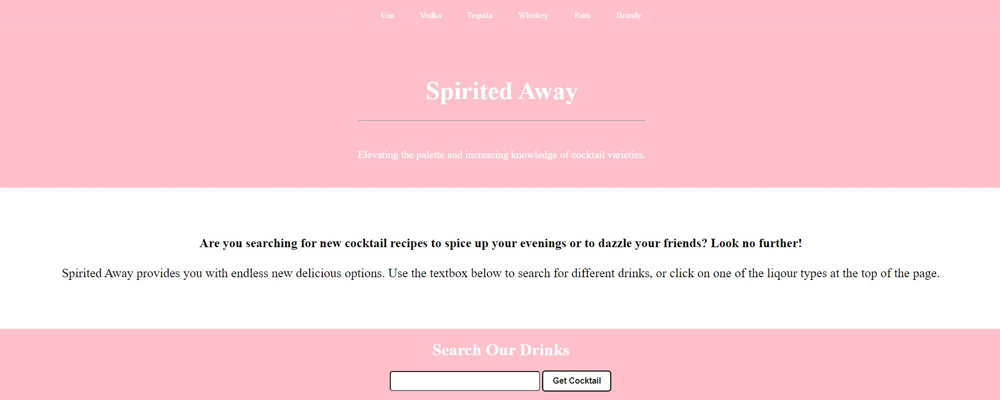

# spiritedaway
This is a web application to help people find new cocktail recipes and introduce variety into their lives. 

**Link to project:** https://spiritiedaway.netlify.app/

## How It's Made:

**Tech used:** HTML, CSS, JavaScript

This application was built with a call to an external API with a variety of different cocktail types. I used an event listner to all users to search drinks by name and then input that into the fetch to query the API. Then a card will be displayed and that automically rotates through all matching cocktail recipes with a setTimeout. Clicking on one of the circles will let you see that particular recipe without interrupting the automatic caurosel. A list of common liqour types is in the header to help give query ideas.
